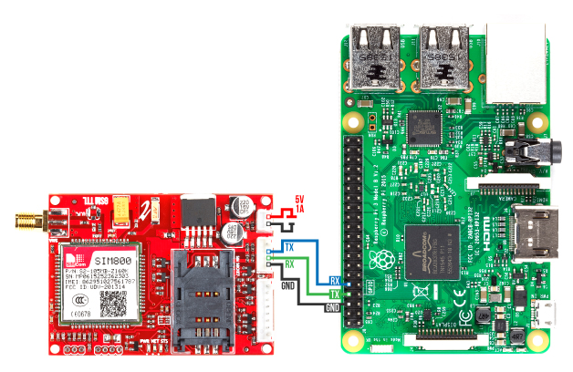

# Raspberry Pi sim800l gsm module
- connecting the raspberry pi to sim8ool gsm module to send, receive sms, delete sms etc.
- based on  https://github.com/lamondlab/IteadSIM800.git

##  Requirements
- Raspberry pi 3/2 with Raspbian OS installed.
- Sim800L GSM module
- external power supply for the Sim800L (5v 1A worked for our case, use the correct one for your module)
- A bunch of jumper wires.
- need pySerial

## setup
### Hardware connection

### Disable serial console
We will start by disabling serial console to enable communication between the pi and sim800l via serial0 .

Open the terminal on your pi and run `sudo rasp-config` 
Select Interfaces → Serial 
Select No to the 1st prompt and Yes for the 2nd.

## Usage examples

uncomment last lines in the sms.py and run 